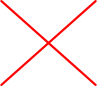
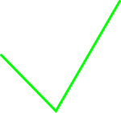
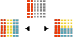
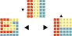
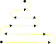
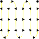

# Redistricting in Square and Triangular Grids

Hugo Akitaya, Kyle Dituro, Andrei Gonczi, Matias Korman, Diane Souvaine, <strong>Frederick Stock</strong>, and Csaba D. Toth

Symposium on Simplicity in Algorithms 2026

---

## Redistricting

  

Source: Brennan Center For Justice

---
dragPos:
  map42: 215,290,34,34
  map32: 334,198,34,34
  map22: 674,306,34,34
  map12: 517,202,34,34
  d05: Left,Top,Width,Height
  d23: Left,Top,Width,Height
  d23r: Left,Top,Width,Height
  d32: Left,Top,Width,Height
  bell: Left,Top,Width,Height
---

## Mathematics in Redistricting

Question: How do you prove gerrymandering?

<v-click>

* Statistical Analysis
* Sample possible district maps and compare to real world 

</v-click>

<v-drag v-click="3" pos="map12">

2 3

</v-drag>

<v-drag v-click="4" pos="map22">

3 2

</v-drag>

<v-drag v-click="2" pos="map32">

2 3

</v-drag>

<v-drag v-click="5" pos="map42">

0 5

</v-drag>

---

## Mathematics in Redistricting

Question: How do you prove gerrymandering?

* Statistical Analysis
* Sample possible district maps and compare to real world 

Question: How should we sample these district maps?

<v-clicks class="absolute top-0 left-0">

* <strong>Our answer:</strong> Markovian Models

</v-clicks>

---

## Setting

* <strong>Map:</strong> A graph $M = (V,E)$ that is either:

  <v-click at="1">

  1.  An equilateral subsection of the triangular grid 

  </v-click>
  <v-click at="2"> 

  2. A $m \times n$ subset of the integer lattice $\mathbb{Z}^2$ 
  
  </v-click>

  <v-click>
    <!--  -->
      

      

        

          <AniHex squares='{"sq":"grey-hexagon.svg","ind":"0"}'/>
        

        

          <AniHex squares='{"sq":"grey-hexagon.svg","ind":"0"}'/>
          <AniHex squares='{"sq":"grey-hexagon.svg","ind":"0"}'/>
        

        

          <AniHex squares='{"sq":"grey-hexagon.svg","ind":"0"}'/>
          <AniHex squares='{"sq":"grey-hexagon.svg","ind":"0"}'/>
          <AniHex squares='{"sq":"grey-hexagon.svg","ind":"0"}'/>
        

        

          <AniHex squares='{"sq":"grey-hexagon.svg","ind":"0"}'/>
          <AniHex squares='{"sq":"grey-hexagon.svg","ind":"0"}'/>
          <AniHex squares='{"sq":"grey-hexagon.svg","ind":"0"}'/>
          <AniHex squares='{"sq":"grey-hexagon.svg","ind":"0"}'/>
        

        

          <AniHex squares='{"sq":"grey-hexagon.svg","ind":"0"}'/>
          <AniHex squares='{"sq":"grey-hexagon.svg","ind":"0"}'/>
          <AniHex squares='{"sq":"grey-hexagon.svg","ind":"0"}'/>
          <AniHex squares='{"sq":"grey-hexagon.svg","ind":"0"}'/>
          <AniHex squares='{"sq":"grey-hexagon.svg","ind":"0"}'/>
        

        

          <AniHex squares='{"sq":"grey-hexagon.svg","ind":"0"}'/>
          <AniHex squares='{"sq":"grey-hexagon.svg","ind":"0"}'/>
          <AniHex squares='{"sq":"grey-hexagon.svg","ind":"0"}'/>
          <AniHex squares='{"sq":"grey-hexagon.svg","ind":"0"}'/>
          <AniHex squares='{"sq":"grey-hexagon.svg","ind":"0"}'/>
          <AniHex squares='{"sq":"grey-hexagon.svg","ind":"0"}'/>
        

      

    

  </v-click>
  <v-click>
    <!--  -->
      

        

          
<AniSquare squares='{"sq":"grey-square.svg","ind":"0"}'/>

          
<AniSquare squares='{"sq":"grey-square.svg","ind":"0"}'/>

          
<AniSquare squares='{"sq":"grey-square.svg","ind":"0"}'/>

          
<AniSquare squares='{"sq":"grey-square.svg","ind":"0"}'/>

          
<AniSquare squares='{"sq":"grey-square.svg","ind":"0"}'/>

          
<AniSquare squares='{"sq":"grey-square.svg","ind":"0"}'/>

          
<AniSquare squares='{"sq":"grey-square.svg","ind":"0"}'/>

          
<AniSquare squares='{"sq":"grey-square.svg","ind":"0"}'/>

          
<AniSquare squares='{"sq":"grey-square.svg","ind":"0"}'/>

          
<AniSquare squares='{"sq":"grey-square.svg","ind":"0"}'/>

          
<AniSquare squares='{"sq":"grey-square.svg","ind":"0"}'/>

          
<AniSquare squares='{"sq":"grey-square.svg","ind":"0"}'/>

          
<AniSquare squares='{"sq":"grey-square.svg","ind":"0"}'/>

          
<AniSquare squares='{"sq":"grey-square.svg","ind":"0"}'/>

          
<AniSquare squares='{"sq":"grey-square.svg","ind":"0"}'/>

          
<AniSquare squares='{"sq":"grey-square.svg","ind":"0"}'/>

          
<AniSquare squares='{"sq":"grey-square.svg","ind":"0"}'/>

          
<AniSquare squares='{"sq":"grey-square.svg","ind":"0"}'/>

          
<AniSquare squares='{"sq":"grey-square.svg","ind":"0"}'/>

          
<AniSquare squares='{"sq":"grey-square.svg","ind":"0"}'/>

          
<AniSquare squares='{"sq":"grey-square.svg","ind":"0"}'/>

          
<AniSquare squares='{"sq":"grey-square.svg","ind":"0"}'/>

          
<AniSquare squares='{"sq":"grey-square.svg","ind":"0"}'/>

          
<AniSquare squares='{"sq":"grey-square.svg","ind":"0"}'/>

          
<AniSquare squares='{"sq":"grey-square.svg","ind":"0"}'/>

          
<AniSquare squares='{"sq":"grey-square.svg","ind":"0"}'/>

          
<AniSquare squares='{"sq":"grey-square.svg","ind":"0"}'/>

          
<AniSquare squares='{"sq":"grey-square.svg","ind":"0"}'/>

          
<AniSquare squares='{"sq":"grey-square.svg","ind":"0"}'/>

          
<AniSquare squares='{"sq":"grey-square.svg","ind":"0"}'/>

          
<AniSquare squares='{"sq":"grey-square.svg","ind":"0"}'/>

          
<AniSquare squares='{"sq":"grey-square.svg","ind":"0"}'/>

          
<AniSquare squares='{"sq":"grey-square.svg","ind":"0"}'/>

          
<AniSquare squares='{"sq":"grey-square.svg","ind":"0"}'/>

          
<AniSquare squares='{"sq":"grey-square.svg","ind":"0"}'/>

          
<AniSquare squares='{"sq":"grey-square.svg","ind":"0"}'/>

        

      

  
  </v-click>

---

## Setting

* <strong>Part:</strong> A subdivision of $M$ 
  <v-click>

  * We consider maps with <strong> three parts </strong> 
  * *Not necessarily of equal size 

  </v-click>

<v-click class="absolute top-0 left-0">
  
  * Each part must be <strong>connected</strong> 

</v-click>

  <!--  -->
  

  

    

      <AniHex squares='{"sq":"red-hexagon.svg","ind":"0"}'/>
    

    

      <AniHex squares='{"sq":"red-hexagon.svg","ind":"0"}'/>
      <AniHex squares='{"sq":"yellow-hexagon.svg","ind":"0"}'/>
    

    

      <AniHex squares='{"sq":"red-hexagon.svg","ind":"0"}'/>
      <AniHex squares='{"sq":"red-hexagon.svg","ind":"0"}'/>
      <AniHex squares='{"sq":"yellow-hexagon.svg","ind":"0"}'/>
    

    

      <AniHex squares='{"sq":"red-hexagon.svg","ind":"0"}'/>
      <AniHex squares='{"sq":"red-hexagon.svg","ind":"0"}'/>
      <AniHex squares='{"sq":"yellow-hexagon.svg","ind":"0"}'/>
      <AniHex squares='{"sq":"yellow-hexagon.svg","ind":"0"}'/>
    

    

      <AniHex squares='{"sq":"blue-hexagon.svg","ind":"0"}'/>
      <AniHex squares='{"sq":"yellow-hexagon.svg","ind":"0"}'/>
      <AniHex squares='{"sq":"yellow-hexagon.svg","ind":"0"}'/>
      <AniHex squares='{"sq":"blue-hexagon.svg","ind":"0"}'/>
      <AniHex squares='{"sq":"yellow-hexagon.svg","ind":"0"}'/>
    

    

      <AniHex squares='{"sq":"blue-hexagon.svg","ind":"0"}'/>
      <AniHex squares='{"sq":"blue-hexagon.svg","ind":"0"}'/>
      <AniHex squares='{"sq":"blue-hexagon.svg","ind":"0"}'/>
      <AniHex squares='{"sq":"blue-hexagon.svg","ind":"0"}'/>
      <AniHex squares='{"sq":"blue-hexagon.svg","ind":"0"}'/>
      <AniHex squares='{"sq":"blue-hexagon.svg","ind":"0"}'/>
    

  

  

    
<AniSquare squares='{"sq":"blue-square.svg","ind":"0"}'/>

    
<AniSquare squares='{"sq":"blue-square.svg","ind":"0"}'/>

    
<AniSquare squares='{"sq":"blue-square.svg","ind":"0"}'/>

    
<AniSquare squares='{"sq":"blue-square.svg","ind":"0"}'/>

    
<AniSquare squares='{"sq":"blue-square.svg","ind":"0"}'/>

    
<AniSquare squares='{"sq":"blue-square.svg","ind":"0"}'/>

    
<AniSquare squares='{"sq":"red-square.svg","ind":"0"}'/>

    
<AniSquare squares='{"sq":"yellow-square.svg","ind":"0"}'/>

    
<AniSquare squares='{"sq":"blue-square.svg","ind":"0"}'/>

    
<AniSquare squares='{"sq":"blue-square.svg","ind":"0"}'/>

    
<AniSquare squares='{"sq":"yellow-square.svg","ind":"0"}'/>

    
<AniSquare squares='{"sq":"blue-square.svg","ind":"0"}'/>

    
<AniSquare squares='{"sq":"red-square.svg","ind":"0"}'/>

    
<AniSquare squares='{"sq":"yellow-square.svg","ind":"0"}'/>

    
<AniSquare squares='{"sq":"yellow-square.svg","ind":"0"}'/>

    
<AniSquare squares='{"sq":"yellow-square.svg","ind":"0"}'/>

    
<AniSquare squares='{"sq":"yellow-square.svg","ind":"0"}'/>

    
<AniSquare squares='{"sq":"blue-square.svg","ind":"0"}'/>

    
<AniSquare squares='{"sq":"red-square.svg","ind":"0"}'/>

    
<AniSquare squares='{"sq":"red-square.svg","ind":"0"}'/>

    
<AniSquare squares='{"sq":"yellow-square.svg","ind":"0"}'/>

    
<AniSquare squares='{"sq":"yellow-square.svg","ind":"0"}'/>

    
<AniSquare squares='{"sq":"red-square.svg","ind":"0"}'/>

    
<AniSquare squares='{"sq":"blue-square.svg","ind":"0"}'/>

    
<AniSquare squares='{"sq":"red-square.svg","ind":"0"}'/>

    
<AniSquare squares='{"sq":"red-square.svg","ind":"0"}'/>

    
<AniSquare squares='{"sq":"yellow-square.svg","ind":"0"}'/>

    
<AniSquare squares='{"sq":"red-square.svg","ind":"0"}'/>

    
<AniSquare squares='{"sq":"red-square.svg","ind":"0"}'/>

    
<AniSquare squares='{"sq":"blue-square.svg","ind":"0"}'/>

    
<AniSquare squares='{"sq":"red-square.svg","ind":"0"}'/>

    
<AniSquare squares='{"sq":"red-square.svg","ind":"0"}'/>

    
<AniSquare squares='{"sq":"red-square.svg","ind":"0"}'/>

    
<AniSquare squares='{"sq":"red-square.svg","ind":"0"}'/>

    
<AniSquare squares='{"sq":"blue-square.svg","ind":"0"}'/>

    
<AniSquare squares='{"sq":"blue-square.svg","ind":"0"}'/>

  

  <!--  -->

---

## Setting

<strong>Recombination:</strong> "Merge two adjacent parts and redraw their shared boundary"

  <v-click>
  <!-- </v-click> -->
  

  

    
<AniSquare squares='{"sq":"blue-square.svg","ind":"0"}'/>

    
<AniSquare squares='{"sq":"blue-square.svg","ind":"0"}'/>

    
<AniSquare squares='{"sq":"blue-square.svg","ind":"0"}'/>

    
<AniSquare squares='{"sq":"blue-square.svg","ind":"0"}'/>

    
<AniSquare squares='{"sq":"blue-square.svg","ind":"0"}'/>

    
<AniSquare squares='{"sq":"blue-square.svg","ind":"0"}'/>

    
<AniSquare squares='{"sq":"red-square.svg","ind":"0"}'/>

    
<AniSquare squares='{"sq":"yellow-square.svg","ind":"0"}'/>

    
<AniSquare squares='{"sq":"blue-square.svg","ind":"0"}'/>

    
<AniSquare squares='{"sq":"blue-square.svg","ind":"0"}'/>

    
<AniSquare squares='{"sq":"yellow-square.svg","ind":"0"}'/>

    
<AniSquare squares='{"sq":"blue-square.svg","ind":"0"}'/>

    
<AniSquare squares='{"sq":"red-square.svg","ind":"0"}'/>

    
<AniSquare squares='{"sq":"yellow-square.svg","ind":"0"}'/>

    
<AniSquare squares='{"sq":"yellow-square.svg","ind":"0"}'/>

    
<AniSquare squares='{"sq":"yellow-square.svg","ind":"0"}'/>

    
<AniSquare squares='{"sq":"yellow-square.svg","ind":"0"}'/>

    
<AniSquare squares='{"sq":"blue-square.svg","ind":"0"}'/>

    
<AniSquare squares='{"sq":"red-square.svg","ind":"0"}'/>

    
<AniSquare squares='{"sq":"yellow-square.svg","ind":"0"}'/>

    
<AniSquare squares='{"sq":"yellow-square.svg","ind":"0"}'/>

    
<AniSquare squares='{"sq":"yellow-square.svg","ind":"0"}'/>

    
<AniSquare squares='{"sq":"blue-square.svg","ind":"0"}'/>

    
<AniSquare squares='{"sq":"blue-square.svg","ind":"0"}'/>

    
<AniSquare squares='{"sq":"red-square.svg","ind":"0"}'/>

    
<AniSquare squares='{"sq":"red-square.svg","ind":"0"}'/>

    
<AniSquare squares='{"sq":"yellow-square.svg","ind":"0"}'/>

    
<AniSquare squares='{"sq":"red-square.svg","ind":"0"}'/>

    
<AniSquare squares='{"sq":"red-square.svg","ind":"0"}'/>

    
<AniSquare squares='{"sq":"blue-square.svg","ind":"0"}'/>

    
<AniSquare squares='{"sq":"red-square.svg","ind":"0"}'/>

    
<AniSquare squares='{"sq":"red-square.svg","ind":"0"}'/>

    
<AniSquare squares='{"sq":"red-square.svg","ind":"0"}'/>

    
<AniSquare squares='{"sq":"red-square.svg","ind":"0"}'/>

    
<AniSquare squares='{"sq":"blue-square.svg","ind":"0"}'/>

    
<AniSquare squares='{"sq":"blue-square.svg","ind":"0"}'/>

  

  </v-click>
  <v-click>
  <!--  -->
  

  

    
<AniSquare squares='{"sq":"blue-square.svg","ind":"0"}'/>

    
<AniSquare squares='{"sq":"blue-square.svg","ind":"0"}'/>

    
<AniSquare squares='{"sq":"blue-square.svg","ind":"0"}'/>

    
<AniSquare squares='{"sq":"blue-square.svg","ind":"0"}'/>

    
<AniSquare squares='{"sq":"blue-square.svg","ind":"0"}'/>

    
<AniSquare squares='{"sq":"blue-square.svg","ind":"0"}'/>

    
<AniSquare squares='{"sq":"grey-square.svg","ind":"0"}'/>

    
<AniSquare squares='{"sq":"grey-square.svg","ind":"0"}'/>

    
<AniSquare squares='{"sq":"blue-square.svg","ind":"0"}'/>

    
<AniSquare squares='{"sq":"blue-square.svg","ind":"0"}'/>

    
<AniSquare squares='{"sq":"grey-square.svg","ind":"0"}'/>

    
<AniSquare squares='{"sq":"blue-square.svg","ind":"0"}'/>

    
<AniSquare squares='{"sq":"grey-square.svg","ind":"0"}'/>

    
<AniSquare squares='{"sq":"grey-square.svg","ind":"0"}'/>

    
<AniSquare squares='{"sq":"grey-square.svg","ind":"0"}'/>

    
<AniSquare squares='{"sq":"grey-square.svg","ind":"0"}'/>

    
<AniSquare squares='{"sq":"grey-square.svg","ind":"0"}'/>

    
<AniSquare squares='{"sq":"blue-square.svg","ind":"0"}'/>

    
<AniSquare squares='{"sq":"grey-square.svg","ind":"0"}'/>

    
<AniSquare squares='{"sq":"grey-square.svg","ind":"0"}'/>

    
<AniSquare squares='{"sq":"grey-square.svg","ind":"0"}'/>

    
<AniSquare squares='{"sq":"grey-square.svg","ind":"0"}'/>

    
<AniSquare squares='{"sq":"blue-square.svg","ind":"0"}'/>

    
<AniSquare squares='{"sq":"blue-square.svg","ind":"0"}'/>

    
<AniSquare squares='{"sq":"grey-square.svg","ind":"0"}'/>

    
<AniSquare squares='{"sq":"grey-square.svg","ind":"0"}'/>

    
<AniSquare squares='{"sq":"grey-square.svg","ind":"0"}'/>

    
<AniSquare squares='{"sq":"grey-square.svg","ind":"0"}'/>

    
<AniSquare squares='{"sq":"grey-square.svg","ind":"0"}'/>

    
<AniSquare squares='{"sq":"blue-square.svg","ind":"0"}'/>

    
<AniSquare squares='{"sq":"grey-square.svg","ind":"0"}'/>

    
<AniSquare squares='{"sq":"grey-square.svg","ind":"0"}'/>

    
<AniSquare squares='{"sq":"grey-square.svg","ind":"0"}'/>

    
<AniSquare squares='{"sq":"grey-square.svg","ind":"0"}'/>

    
<AniSquare squares='{"sq":"blue-square.svg","ind":"0"}'/>

    
<AniSquare squares='{"sq":"blue-square.svg","ind":"0"}'/>

  

  </v-click>
  <v-click>
  <!--  -->
  

  

    
<AniSquare squares='{"sq":"blue-square.svg","ind":"0"}'/>

    
<AniSquare squares='{"sq":"blue-square.svg","ind":"0"}'/>

    
<AniSquare squares='{"sq":"blue-square.svg","ind":"0"}'/>

    
<AniSquare squares='{"sq":"blue-square.svg","ind":"0"}'/>

    
<AniSquare squares='{"sq":"blue-square.svg","ind":"0"}'/>

    
<AniSquare squares='{"sq":"blue-square.svg","ind":"0"}'/>

    
<AniSquare squares='{"sq":"yellow-square.svg","ind":"0"}'/>

    
<AniSquare squares='{"sq":"yellow-square.svg","ind":"0"}'/>

    
<AniSquare squares='{"sq":"blue-square.svg","ind":"0"}'/>

    
<AniSquare squares='{"sq":"blue-square.svg","ind":"0"}'/>

    
<AniSquare squares='{"sq":"red-square.svg","ind":"0"}'/>

    
<AniSquare squares='{"sq":"blue-square.svg","ind":"0"}'/>

    
<AniSquare squares='{"sq":"yellow-square.svg","ind":"0"}'/>

    
<AniSquare squares='{"sq":"yellow-square.svg","ind":"0"}'/>

    
<AniSquare squares='{"sq":"yellow-square.svg","ind":"0"}'/>

    
<AniSquare squares='{"sq":"red-square.svg","ind":"0"}'/>

    
<AniSquare squares='{"sq":"red-square.svg","ind":"0"}'/>

    
<AniSquare squares='{"sq":"blue-square.svg","ind":"0"}'/>

    
<AniSquare squares='{"sq":"yellow-square.svg","ind":"0"}'/>

    
<AniSquare squares='{"sq":"yellow-square.svg","ind":"0"}'/>

    
<AniSquare squares='{"sq":"yellow-square.svg","ind":"0"}'/>

    
<AniSquare squares='{"sq":"red-square.svg","ind":"0"}'/>

    
<AniSquare squares='{"sq":"blue-square.svg","ind":"0"}'/>

    
<AniSquare squares='{"sq":"blue-square.svg","ind":"0"}'/>

    
<AniSquare squares='{"sq":"yellow-square.svg","ind":"0"}'/>

    
<AniSquare squares='{"sq":"red-square.svg","ind":"0"}'/>

    
<AniSquare squares='{"sq":"red-square.svg","ind":"0"}'/>

    
<AniSquare squares='{"sq":"red-square.svg","ind":"0"}'/>

    
<AniSquare squares='{"sq":"red-square.svg","ind":"0"}'/>

    
<AniSquare squares='{"sq":"blue-square.svg","ind":"0"}'/>

    
<AniSquare squares='{"sq":"yellow-square.svg","ind":"0"}'/>

    
<AniSquare squares='{"sq":"red-square.svg","ind":"0"}'/>

    
<AniSquare squares='{"sq":"red-square.svg","ind":"0"}'/>

    
<AniSquare squares='{"sq":"red-square.svg","ind":"0"}'/>

    
<AniSquare squares='{"sq":"blue-square.svg","ind":"0"}'/>

    
<AniSquare squares='{"sq":"blue-square.svg","ind":"0"}'/>

  

  </v-click>

---

## Recombination Markov Chains

* Samples uniformly from distribution of spanning trees over <strong>M</strong>

<v-clicks class="absolute top-0 left-0">

* Favors "compact" parts of <strong>M</strong>
  * Preferable for voting maps
* If recombination is <strong>universal</strong>, then the Markov chain is <strong>irreducible</strong> 
  * <strong>Universality</strong> $\Rightarrow$ any map can be turned into another 

</v-clicks>

---
clicks: 5
---

## Recombination

<strong> Is recombination universal? </strong>

<v-click class="absolute top-0 left-0">

<strong>Slack:</strong> How much a part's size may vary from initialization.

* $\infty$-Slack $\Rightarrow$ Too simple

</v-click>

  

    
<AniSquare squares='{"sq":"blue-square.svg","ind":"1"};{"sq":"grey-square.svg","ind":"4"};{"sq":"yellow-square.svg","ind":"5"}'/>

    
<AniSquare squares='{"sq":"blue-square.svg","ind":"1"};{"sq":"grey-square.svg","ind":"4"};{"sq":"yellow-square.svg","ind":"5"}'/>

    
<AniSquare squares='{"sq":"blue-square.svg","ind":"1"};{"sq":"grey-square.svg","ind":"4"};{"sq":"yellow-square.svg","ind":"5"}'/>

    
<AniSquare squares='{"sq":"blue-square.svg","ind":"1"};{"sq":"grey-square.svg","ind":"4"};{"sq":"yellow-square.svg","ind":"5"}'/>

    
<AniSquare squares='{"sq":"blue-square.svg","ind":"1"};{"sq":"grey-square.svg","ind":"4"};{"sq":"yellow-square.svg","ind":"5"}'/>

    
<AniSquare squares='{"sq":"blue-square.svg","ind":"1"};{"sq":"grey-square.svg","ind":"4"};{"sq":"yellow-square.svg","ind":"5"}'/>

    
<AniSquare squares='{"sq":"red-square.svg","ind":"1"};{"sq":"grey-square.svg","ind":"2"};{"sq":"yellow-square.svg","ind":"3"};{"sq":"grey-square.svg","ind":"4"};{"sq":"yellow-square.svg","ind":"5"}'/>

    
<AniSquare squares='{"sq":"yellow-square.svg","ind":"1"};{"sq":"grey-square.svg","ind":"2"};{"sq":"yellow-square.svg","ind":"3"};{"sq":"grey-square.svg","ind":"4"};{"sq":"yellow-square.svg","ind":"5"}'/>

    
<AniSquare squares='{"sq":"blue-square.svg","ind":"1"};{"sq":"grey-square.svg","ind":"4"};{"sq":"yellow-square.svg","ind":"5"}'/>

    
<AniSquare squares='{"sq":"blue-square.svg","ind":"1"};{"sq":"grey-square.svg","ind":"4"};{"sq":"yellow-square.svg","ind":"5"}'/>

    
<AniSquare squares='{"sq":"yellow-square.svg","ind":"1"};{"sq":"grey-square.svg","ind":"2"};{"sq":"yellow-square.svg","ind":"3"};{"sq":"grey-square.svg","ind":"4"};{"sq":"yellow-square.svg","ind":"5"}'/>

    
<AniSquare squares='{"sq":"blue-square.svg","ind":"1"};{"sq":"grey-square.svg","ind":"4"};{"sq":"yellow-square.svg","ind":"5"}'/>

    
<AniSquare squares='{"sq":"red-square.svg","ind":"1"};{"sq":"grey-square.svg","ind":"2"};{"sq":"yellow-square.svg","ind":"3"};{"sq":"grey-square.svg","ind":"4"};{"sq":"yellow-square.svg","ind":"5"}'/>

    
<AniSquare squares='{"sq":"yellow-square.svg","ind":"1"};{"sq":"grey-square.svg","ind":"2"};{"sq":"yellow-square.svg","ind":"3"};{"sq":"grey-square.svg","ind":"4"};{"sq":"yellow-square.svg","ind":"5"}'/>

    
<AniSquare squares='{"sq":"yellow-square.svg","ind":"1"};{"sq":"grey-square.svg","ind":"2"};{"sq":"yellow-square.svg","ind":"3"};{"sq":"grey-square.svg","ind":"4"};{"sq":"yellow-square.svg","ind":"5"}'/>

    
<AniSquare squares='{"sq":"yellow-square.svg","ind":"1"};{"sq":"grey-square.svg","ind":"2"};{"sq":"yellow-square.svg","ind":"3"};{"sq":"grey-square.svg","ind":"4"};{"sq":"yellow-square.svg","ind":"5"}'/>

    
<AniSquare squares='{"sq":"yellow-square.svg","ind":"1"};{"sq":"grey-square.svg","ind":"2"};{"sq":"yellow-square.svg","ind":"3"};{"sq":"grey-square.svg","ind":"4"};{"sq":"yellow-square.svg","ind":"5"}'/>

    
<AniSquare squares='{"sq":"blue-square.svg","ind":"1"};{"sq":"grey-square.svg","ind":"4"};{"sq":"yellow-square.svg","ind":"5"}'/>

    
<AniSquare squares='{"sq":"red-square.svg","ind":"1"};{"sq":"grey-square.svg","ind":"2"};{"sq":"yellow-square.svg","ind":"3"};{"sq":"grey-square.svg","ind":"4"};{"sq":"yellow-square.svg","ind":"5"}'/>

    
<AniSquare squares='{"sq":"yellow-square.svg","ind":"1"};{"sq":"grey-square.svg","ind":"2"};{"sq":"yellow-square.svg","ind":"3"};{"sq":"grey-square.svg","ind":"4"};{"sq":"yellow-square.svg","ind":"5"}'/>

    
<AniSquare squares='{"sq":"yellow-square.svg","ind":"1"};{"sq":"grey-square.svg","ind":"2"};{"sq":"yellow-square.svg","ind":"3"};{"sq":"grey-square.svg","ind":"4"};{"sq":"yellow-square.svg","ind":"5"}'/>

    
<AniSquare squares='{"sq":"yellow-square.svg","ind":"1"};{"sq":"grey-square.svg","ind":"2"};{"sq":"yellow-square.svg","ind":"3"};{"sq":"grey-square.svg","ind":"4"};{"sq":"yellow-square.svg","ind":"5"}'/>

    
<AniSquare squares='{"sq":"blue-square.svg","ind":"1"};{"sq":"grey-square.svg","ind":"4"};{"sq":"yellow-square.svg","ind":"5"}'/>

    
<AniSquare squares='{"sq":"blue-square.svg","ind":"1"};{"sq":"grey-square.svg","ind":"4"};{"sq":"yellow-square.svg","ind":"5"}'/>

    
<AniSquare squares='{"sq":"red-square.svg","ind":"1"};{"sq":"grey-square.svg","ind":"2"};{"sq":"yellow-square.svg","ind":"3"};{"sq":"grey-square.svg","ind":"4"};{"sq":"yellow-square.svg","ind":"5"}'/>

    
<AniSquare squares='{"sq":"red-square.svg","ind":"1"};{"sq":"grey-square.svg","ind":"2"};{"sq":"yellow-square.svg","ind":"3"};{"sq":"grey-square.svg","ind":"4"};{"sq":"yellow-square.svg","ind":"5"}'/>

    
<AniSquare squares='{"sq":"yellow-square.svg","ind":"1"};{"sq":"grey-square.svg","ind":"2"};{"sq":"yellow-square.svg","ind":"3"};{"sq":"grey-square.svg","ind":"4"};{"sq":"yellow-square.svg","ind":"5"}'/>

    
<AniSquare squares='{"sq":"red-square.svg","ind":"1"};{"sq":"grey-square.svg","ind":"2"};{"sq":"yellow-square.svg","ind":"3"};{"sq":"grey-square.svg","ind":"4"};{"sq":"yellow-square.svg","ind":"5"}'/>

    
<AniSquare squares='{"sq":"red-square.svg","ind":"1"};{"sq":"grey-square.svg","ind":"2"};{"sq":"yellow-square.svg","ind":"3"};{"sq":"grey-square.svg","ind":"4"};{"sq":"yellow-square.svg","ind":"5"}'/>

    
<AniSquare squares='{"sq":"blue-square.svg","ind":"1"};{"sq":"grey-square.svg","ind":"4"};{"sq":"yellow-square.svg","ind":"5"}'/>

    
<AniSquare squares='{"sq":"red-square.svg","ind":"1"};{"sq":"grey-square.svg","ind":"2"};{"sq":"red-square.svg","ind":"3"}'/>

    
<AniSquare squares='{"sq":"red-square.svg","ind":"1"};{"sq":"grey-square.svg","ind":"2"};{"sq":"yellow-square.svg","ind":"3"};{"sq":"grey-square.svg","ind":"4"};{"sq":"blue-square.svg","ind":"5"}'/>

    
<AniSquare squares='{"sq":"red-square.svg","ind":"1"};{"sq":"grey-square.svg","ind":"2"};{"sq":"yellow-square.svg","ind":"3"};{"sq":"grey-square.svg","ind":"4"};{"sq":"yellow-square.svg","ind":"5"}'/>

    
<AniSquare squares='{"sq":"red-square.svg","ind":"1"};{"sq":"grey-square.svg","ind":"2"};{"sq":"yellow-square.svg","ind":"3"};{"sq":"grey-square.svg","ind":"4"};{"sq":"yellow-square.svg","ind":"5"}'/>

    
<AniSquare squares='{"sq":"blue-square.svg","ind":"1"};{"sq":"grey-square.svg","ind":"4"};{"sq":"yellow-square.svg","ind":"5"}'/>

    
<AniSquare squares='{"sq":"blue-square.svg","ind":"1"};{"sq":"grey-square.svg","ind":"4"};{"sq":"yellow-square.svg","ind":"5"}'/>

  

---
clicks: 6
---

## Recombination

<strong> Is recombination universal? </strong>

<strong>Slack:</strong> How much a part's size may vary from initialization.

* $\infty$-Slack $\Rightarrow$ Too simple

* 0-Slack $\Rightarrow$ leads to "rigid" configurations   $\Rightarrow$ not universal  

<v-click at="6">

* <strong> We use 1-slack </strong>

</v-click>

<!-- 

  <v-click></v-click>
  <v-click></v-click>
  <v-click></v-click>

 -->

  

    
<AniSquare squares='{"sq":"blue.svg","ind":"0"};{"sq":"lightgray_dot.svg","ind":"1"};{"sq":"lightgray.svg","ind":"2"}'/>

    
<AniSquare squares='{"sq":"blue.svg","ind":"0"};{"sq":"lightgray_dot.svg","ind":"1"};{"sq":"lightgray.svg","ind":"2"}'/>

    
<AniSquare squares='{"sq":"red.svg","ind":"0"}'/>

    
<AniSquare squares='{"sq":"red.svg","ind":"0"}'/>

    
<AniSquare squares='{"sq":"yellow.svg","ind":"0"}'/>

    
<AniSquare squares='{"sq":"yellow.svg","ind":"0"}'/>

    
<AniSquare squares='{"sq":"blue.svg","ind":"0"};{"sq":"lightgray_dot.svg","ind":"1"};{"sq":"lightgray.svg","ind":"2"}'/>

    
<AniSquare squares='{"sq":"lightgray.svg","ind":"0"};{"sq":"lightgray_dot.svg","ind":"1"};{"sq":"blue.svg","ind":"2"}'/>

    
<AniSquare squares='{"sq":"lightgray.svg","ind":"0"};{"sq":"lightgray_dot.svg","ind":"1"};{"sq":"blue.svg","ind":"2"}'/>

    
<AniSquare squares='{"sq":"red.svg","ind":"0"}'/>

    
<AniSquare squares='{"sq":"white.svg","ind":"0"}'/>

    
<AniSquare squares='{"sq":"yellow.svg","ind":"0"}'/>

    
<AniSquare squares='{"sq":"magenta.svg","ind":"0"}'/>

    
<AniSquare squares='{"sq":"magenta.svg","ind":"0"}'/>

    
<AniSquare squares='{"sq":"lightgray.svg","ind":"0"};{"sq":"lightgray_dot.svg","ind":"1"};{"sq":"blue.svg","ind":"2"}'/>

    
<AniSquare squares='{"sq":"white.svg","ind":"0"}'/>

    
<AniSquare squares='{"sq":"white.svg","ind":"0"}'/>

    
<AniSquare squares='{"sq":"darkred.svg","ind":"0"}'/>

    
<AniSquare squares='{"sq":"magenta.svg","ind":"0"}'/>

    
<AniSquare squares='{"sq":"darkblue.svg","ind":"0"}'/>

    
<AniSquare squares='{"sq":"darkblue.svg","ind":"0"}'/>

    
<AniSquare squares='{"sq":"black.svg","ind":"0"}'/>

    
<AniSquare squares='{"sq":"darkred.svg","ind":"0"}'/>

    
<AniSquare squares='{"sq":"darkred.svg","ind":"0"}'/>

    
<AniSquare squares='{"sq":"cyan.svg","ind":"0"};{"sq":"lightgray_dot.svg","ind":"3"};{"sq":"green.svg","ind":"4"}'/>

    
<AniSquare squares='{"sq":"darkblue.svg","ind":"0"}'/>

    
<AniSquare squares='{"sq":"green.svg","ind":"0"};{"sq":"lightgray_dot.svg","ind":"3"};{"sq":"cyan.svg","ind":"4"}'/>

    
<AniSquare squares='{"sq":"black.svg","ind":"0"}'/>

    
<AniSquare squares='{"sq":"black.svg","ind":"0"}'/>

    
<AniSquare squares='{"sq":"purple.svg","ind":"0"}'/>

    
<AniSquare squares='{"sq":"cyan.svg","ind":"0"};{"sq":"lightgray_dot.svg","ind":"3"};{"sq":"green.svg","ind":"4"}'/>

    
<AniSquare squares='{"sq":"cyan.svg","ind":"0"};{"sq":"lightgray_dot.svg","ind":"3"};{"sq":"green.svg","ind":"4"}'/>

    
<AniSquare squares='{"sq":"green.svg","ind":"0"};{"sq":"lightgray_dot.svg","ind":"3"};{"sq":"cyan.svg","ind":"4"}'/>

    
<AniSquare squares='{"sq":"green.svg","ind":"0"};{"sq":"lightgray_dot.svg","ind":"3"};{"sq":"cyan.svg","ind":"4"}'/>

    
<AniSquare squares='{"sq":"purple.svg","ind":"0"}'/>

    
<AniSquare squares='{"sq":"purple.svg","ind":"0"}'/>

  

---

## Previous Work

<strong>(Cannon 2024)</strong> *Irreducibility of Recombination Markov Chains in the Triangular Lattice* 
<v-clicks class="darklist">

  * Universality of recombination 
  * 3 parts with $\pm 1$ Slack 
  * <strong>Only</strong> triangular lattice 
  * <strong>Only</strong> simply connected parts 
  * $O(n^3)$ recombinations 

</v-clicks>

  <v-click at="3">
  

    

      <AniHex squares='{"sq":"red-hexagon.svg","ind":"0"}'/>
    

    

      <AniHex squares='{"sq":"red-hexagon.svg","ind":"0"}'/>
      <AniHex squares='{"sq":"yellow-hexagon.svg","ind":"0"}'/>
    

    

      <AniHex squares='{"sq":"red-hexagon.svg","ind":"0"}'/>
      <AniHex squares='{"sq":"red-hexagon.svg","ind":"0"}'/>
      <AniHex squares='{"sq":"yellow-hexagon.svg","ind":"0"}'/>
    

    

      <AniHex squares='{"sq":"red-hexagon.svg","ind":"0"}'/>
      <AniHex squares='{"sq":"red-hexagon.svg","ind":"0"}'/>
      <AniHex squares='{"sq":"yellow-hexagon.svg","ind":"0"}'/>
      <AniHex squares='{"sq":"yellow-hexagon.svg","ind":"0"}'/>
    

    

      <AniHex squares='{"sq":"blue-hexagon.svg","ind":"0"}'/>
      <AniHex squares='{"sq":"yellow-hexagon.svg","ind":"0"}'/>
      <AniHex squares='{"sq":"yellow-hexagon.svg","ind":"0"}'/>
      <AniHex squares='{"sq":"blue-hexagon.svg","ind":"0"}'/>
      <AniHex squares='{"sq":"yellow-hexagon.svg","ind":"0"}'/>
    

    

      <AniHex squares='{"sq":"blue-hexagon.svg","ind":"0"}'/>
      <AniHex squares='{"sq":"blue-hexagon.svg","ind":"0"}'/>
      <AniHex squares='{"sq":"blue-hexagon.svg","ind":"0"}'/>
      <AniHex squares='{"sq":"blue-hexagon.svg","ind":"0"}'/>
      <AniHex squares='{"sq":"blue-hexagon.svg","ind":"0"}'/>
      <AniHex squares='{"sq":"blue-hexagon.svg","ind":"0"}'/>
    

  

  </v-click>

  
  <v-click at="4" class="relative">
  

    

      <AniHex squares='{"sq":"red-hexagon.svg","ind":"0"}'/>
    

    

      <AniHex squares='{"sq":"red-hexagon.svg","ind":"0"}'/>
      <AniHex squares='{"sq":"red-hexagon.svg","ind":"0"}'/>
    

    

      <AniHex squares='{"sq":"red-hexagon.svg","ind":"0"}'/>
      <AniHex squares='{"sq":"blue-hexagon.svg","ind":"0"}'/>
      <AniHex squares='{"sq":"blue-hexagon.svg","ind":"0"}'/>
    

    

      <AniHex squares='{"sq":"red-hexagon.svg","ind":"0"}'/>
      <AniHex squares='{"sq":"blue-hexagon.svg","ind":"0"}'/>
      <AniHex squares='{"sq":"yellow-hexagon.svg","ind":"0"}'/>
      <AniHex squares='{"sq":"blue-hexagon.svg","ind":"0"}'/>
    

    

      <AniHex squares='{"sq":"red-hexagon.svg","ind":"0"}'/>
      <AniHex squares='{"sq":"blue-hexagon.svg","ind":"0"}'/>
      <AniHex squares='{"sq":"yellow-hexagon.svg","ind":"0"}'/>
      <AniHex squares='{"sq":"yellow-hexagon.svg","ind":"0"}'/>
      <AniHex squares='{"sq":"blue-hexagon.svg","ind":"0"}'/>
    

    

      <AniHex squares='{"sq":"red-hexagon.svg","ind":"0"}'/>
      <AniHex squares='{"sq":"blue-hexagon.svg","ind":"0"}'/>
      <AniHex squares='{"sq":"blue-hexagon.svg","ind":"0"}'/>
      <AniHex squares='{"sq":"blue-hexagon.svg","ind":"0"}'/>
      <AniHex squares='{"sq":"blue-hexagon.svg","ind":"0"}'/>
      <AniHex squares='{"sq":"blue-hexagon.svg","ind":"0"}'/>
    

  

    </img>
  </v-click>

---

##  <del>Previous Work</del>  Our Results

<strong>(Akitaya et al. 2026)</strong> *Redistricting in Square and Triangular Grids*

- Universality of recombination 
- 3 parts with $\pm 1$ Slack 

<v-clicks class="darklist">

-  <del>Only</del>  Triangular and Square grid  
-  <del>Only simply connected parts</del> Connected parts  
- $O(n^3)$ recombinations 

</v-clicks>

  <v-click at="1" hide>
  

    

      <AniHex squares='{"sq":"red-hexagon.svg","ind":"0"}'/>
    

    

      <AniHex squares='{"sq":"red-hexagon.svg","ind":"0"}'/>
      <AniHex squares='{"sq":"yellow-hexagon.svg","ind":"0"}'/>
    

    

      <AniHex squares='{"sq":"red-hexagon.svg","ind":"0"}'/>
      <AniHex squares='{"sq":"red-hexagon.svg","ind":"0"}'/>
      <AniHex squares='{"sq":"yellow-hexagon.svg","ind":"0"}'/>
    

    

      <AniHex squares='{"sq":"red-hexagon.svg","ind":"0"}'/>
      <AniHex squares='{"sq":"red-hexagon.svg","ind":"0"}'/>
      <AniHex squares='{"sq":"yellow-hexagon.svg","ind":"0"}'/>
      <AniHex squares='{"sq":"yellow-hexagon.svg","ind":"0"}'/>
    

    

      <AniHex squares='{"sq":"blue-hexagon.svg","ind":"0"}'/>
      <AniHex squares='{"sq":"yellow-hexagon.svg","ind":"0"}'/>
      <AniHex squares='{"sq":"yellow-hexagon.svg","ind":"0"}'/>
      <AniHex squares='{"sq":"blue-hexagon.svg","ind":"0"}'/>
      <AniHex squares='{"sq":"yellow-hexagon.svg","ind":"0"}'/>
    

    

      <AniHex squares='{"sq":"blue-hexagon.svg","ind":"0"}'/>
      <AniHex squares='{"sq":"blue-hexagon.svg","ind":"0"}'/>
      <AniHex squares='{"sq":"blue-hexagon.svg","ind":"0"}'/>
      <AniHex squares='{"sq":"blue-hexagon.svg","ind":"0"}'/>
      <AniHex squares='{"sq":"blue-hexagon.svg","ind":"0"}'/>
      <AniHex squares='{"sq":"blue-hexagon.svg","ind":"0"}'/>
    

  

  </v-click>
  <v-click at="1">
  <!-- </v-click> -->
    

      

        
<AniSquare squares='{"sq":"blue-square.svg","ind":"0"}'/>

        
<AniSquare squares='{"sq":"blue-square.svg","ind":"0"}'/>

        
<AniSquare squares='{"sq":"blue-square.svg","ind":"0"}'/>

        
<AniSquare squares='{"sq":"blue-square.svg","ind":"0"}'/>

        
<AniSquare squares='{"sq":"blue-square.svg","ind":"0"}'/>

        
<AniSquare squares='{"sq":"blue-square.svg","ind":"0"}'/>

        
<AniSquare squares='{"sq":"red-square.svg","ind":"0"}'/>

        
<AniSquare squares='{"sq":"yellow-square.svg","ind":"0"}'/>

        
<AniSquare squares='{"sq":"blue-square.svg","ind":"0"}'/>

        
<AniSquare squares='{"sq":"blue-square.svg","ind":"0"}'/>

        
<AniSquare squares='{"sq":"yellow-square.svg","ind":"0"}'/>

        
<AniSquare squares='{"sq":"blue-square.svg","ind":"0"}'/>

        
<AniSquare squares='{"sq":"red-square.svg","ind":"0"}'/>

        
<AniSquare squares='{"sq":"yellow-square.svg","ind":"0"}'/>

        
<AniSquare squares='{"sq":"yellow-square.svg","ind":"0"}'/>

        
<AniSquare squares='{"sq":"yellow-square.svg","ind":"0"}'/>

        
<AniSquare squares='{"sq":"yellow-square.svg","ind":"0"}'/>

        
<AniSquare squares='{"sq":"blue-square.svg","ind":"0"}'/>

        
<AniSquare squares='{"sq":"red-square.svg","ind":"0"}'/>

        
<AniSquare squares='{"sq":"yellow-square.svg","ind":"0"}'/>

        
<AniSquare squares='{"sq":"yellow-square.svg","ind":"0"}'/>

        
<AniSquare squares='{"sq":"yellow-square.svg","ind":"0"}'/>

        
<AniSquare squares='{"sq":"blue-square.svg","ind":"0"}'/>

        
<AniSquare squares='{"sq":"blue-square.svg","ind":"0"}'/>

        
<AniSquare squares='{"sq":"red-square.svg","ind":"0"}'/>

        
<AniSquare squares='{"sq":"red-square.svg","ind":"0"}'/>

        
<AniSquare squares='{"sq":"yellow-square.svg","ind":"0"}'/>

        
<AniSquare squares='{"sq":"red-square.svg","ind":"0"}'/>

        
<AniSquare squares='{"sq":"red-square.svg","ind":"0"}'/>

        
<AniSquare squares='{"sq":"blue-square.svg","ind":"0"}'/>

        
<AniSquare squares='{"sq":"red-square.svg","ind":"0"}'/>

        
<AniSquare squares='{"sq":"red-square.svg","ind":"0"}'/>

        
<AniSquare squares='{"sq":"red-square.svg","ind":"0"}'/>

        
<AniSquare squares='{"sq":"red-square.svg","ind":"0"}'/>

        
<AniSquare squares='{"sq":"blue-square.svg","ind":"0"}'/>

        
<AniSquare squares='{"sq":"blue-square.svg","ind":"0"}'/>

      

    

  </v-click>

  

    

      <AniHex squares='{"sq":"red-hexagon.svg","ind":"0"}'/>
    

    

      <AniHex squares='{"sq":"red-hexagon.svg","ind":"0"}'/>
      <AniHex squares='{"sq":"red-hexagon.svg","ind":"0"}'/>
    

    

      <AniHex squares='{"sq":"red-hexagon.svg","ind":"0"}'/>
      <AniHex squares='{"sq":"blue-hexagon.svg","ind":"0"}'/>
      <AniHex squares='{"sq":"blue-hexagon.svg","ind":"0"}'/>
    

    

      <AniHex squares='{"sq":"red-hexagon.svg","ind":"0"}'/>
      <AniHex squares='{"sq":"blue-hexagon.svg","ind":"0"}'/>
      <AniHex squares='{"sq":"yellow-hexagon.svg","ind":"0"}'/>
      <AniHex squares='{"sq":"blue-hexagon.svg","ind":"0"}'/>
    

    

      <AniHex squares='{"sq":"red-hexagon.svg","ind":"0"}'/>
      <AniHex squares='{"sq":"blue-hexagon.svg","ind":"0"}'/>
      <AniHex squares='{"sq":"yellow-hexagon.svg","ind":"0"}'/>
      <AniHex squares='{"sq":"yellow-hexagon.svg","ind":"0"}'/>
      <AniHex squares='{"sq":"blue-hexagon.svg","ind":"0"}'/>
    

    

      <AniHex squares='{"sq":"red-hexagon.svg","ind":"0"}'/>
      <AniHex squares='{"sq":"blue-hexagon.svg","ind":"0"}'/>
      <AniHex squares='{"sq":"blue-hexagon.svg","ind":"0"}'/>
      <AniHex squares='{"sq":"blue-hexagon.svg","ind":"0"}'/>
      <AniHex squares='{"sq":"blue-hexagon.svg","ind":"0"}'/>
      <AniHex squares='{"sq":"blue-hexagon.svg","ind":"0"}'/>
    

  

    <v-click hide at="2">
    </img>
    </v-click>
    <v-click at="2">
    </img>
    </v-click>

---

## Our Strategy

- If every map can reach the same configuration $\Rightarrow$ recombination is universal. 

</img>

</img>

</img>

---
clicks: 6

dragPos:
  tri: Left,Top,Width,Height
  sqPath: Left,Top,Width,Height
---

## Our Strategy
</img>

</img>

- If every map can reach the same configuration $\Rightarrow$ recombination is universal. 

1.  Define a <strong>canonical ordering</strong> on <strong>M</strong> 

<v-click at="+2">

2.  Use recombination to assign part 1 ($\mathcal{P}_1$) to the first $|\mathcal{P}_1|$ cells 

</v-click>

<v-click at="+2">

3.  Assign part 2 to the next $|\mathcal{P}_2|$ cells 

</v-click>

<!-- 

  
  

 -->

  

    

      <AniHex squares='{"sq":"grey-hexagon.svg","ind":"1"};{"sq":"red-hexagon.svg","ind":"2"}'/>
    

    

      <AniHex squares='{"sq":"grey-hexagon.svg","ind":"0"};{"sq":"red-hexagon.svg","ind":"2"}'/>
      <AniHex squares='{"sq":"grey-hexagon.svg","ind":"0"};{"sq":"red-hexagon.svg","ind":"2"};{"sq":"yellow-hexagon.svg","ind":"3"};{"sq":"red-hexagon.svg","ind":"4"}'/>
    

    

      <AniHex squares='{"sq":"grey-hexagon.svg","ind":"0"};{"sq":"red-hexagon.svg","ind":"2"}'/>
      <AniHex squares='{"sq":"grey-hexagon.svg","ind":"0"};{"sq":"red-hexagon.svg","ind":"2"}'/>
      <AniHex squares='{"sq":"grey-hexagon.svg","ind":"0"};{"sq":"red-hexagon.svg","ind":"2"};{"sq":"yellow-hexagon.svg","ind":"3"};{"sq":"red-hexagon.svg","ind":"4"}'/>
    

    

      <AniHex squares='{"sq":"grey-hexagon.svg","ind":"0"};{"sq":"yellow-hexagon.svg","ind":"2"};{"sq":"red-hexagon.svg","ind":"3"};{"sq":"yellow-hexagon.svg","ind":"4"}'/>
      <AniHex squares='{"sq":"grey-hexagon.svg","ind":"0"};{"sq":"yellow-hexagon.svg","ind":"2"};{"sq":"red-hexagon.svg","ind":"3"};{"sq":"yellow-hexagon.svg","ind":"4"}'/>
      <AniHex squares='{"sq":"grey-hexagon.svg","ind":"0"};{"sq":"yellow-hexagon.svg","ind":"2"}'/>
      <AniHex squares='{"sq":"grey-hexagon.svg","ind":"0"};{"sq":"yellow-hexagon.svg","ind":"2"}'/>
    

    

      <AniHex squares='{"sq":"grey-hexagon.svg","ind":"0"};{"sq":"yellow-hexagon.svg","ind":"2"};{"sq":"blue-hexagon.svg","ind":"3"};{"sq":"yellow-hexagon.svg","ind":"6"}'/>
      <AniHex squares='{"sq":"grey-hexagon.svg","ind":"0"};{"sq":"yellow-hexagon.svg","ind":"2"}'/>
      <AniHex squares='{"sq":"grey-hexagon.svg","ind":"0"};{"sq":"yellow-hexagon.svg","ind":"2"}'/>
      <AniHex squares='{"sq":"grey-hexagon.svg","ind":"0"};{"sq":"blue-hexagon.svg","ind":"2"}'/>
      <AniHex squares='{"sq":"grey-hexagon.svg","ind":"0"};{"sq":"blue-hexagon.svg","ind":"2"};{"sq":"yellow-hexagon.svg","ind":"3"};{"sq":"blue-hexagon.svg","ind":"6"}'/>
    

    

      <AniHex squares='{"sq":"grey-hexagon.svg","ind":"0"};{"sq":"blue-hexagon.svg","ind":"2"}'/>
      <AniHex squares='{"sq":"grey-hexagon.svg","ind":"0"};{"sq":"blue-hexagon.svg","ind":"2"}'/>
      <AniHex squares='{"sq":"grey-hexagon.svg","ind":"0"};{"sq":"blue-hexagon.svg","ind":"2"}'/>
      <AniHex squares='{"sq":"grey-hexagon.svg","ind":"0"};{"sq":"blue-hexagon.svg","ind":"2"}'/>
      <AniHex squares='{"sq":"grey-hexagon.svg","ind":"0"};{"sq":"blue-hexagon.svg","ind":"2"}'/>
      <AniHex squares='{"sq":"grey-hexagon.svg","ind":"0"};{"sq":"blue-hexagon.svg","ind":"2"}'/>
    

  

  

    
<AniSquare squares='{"sq":"grey-square.svg","ind":"0"};{"sq":"red-square.svg","ind":"2"}'/>

    
<AniSquare squares='{"sq":"grey-square.svg","ind":"0"};{"sq":"yellow-square.svg","ind":"2"};{"sq":"red-square.svg","ind":"3"};{"sq":"yellow-square.svg","ind":"4"}'/>

    
<AniSquare squares='{"sq":"grey-square.svg","ind":"0"};{"sq":"yellow-square.svg","ind":"2"};{"sq":"red-square.svg","ind":"3"};{"sq":"yellow-square.svg","ind":"4"}'/>

    
<AniSquare squares='{"sq":"grey-square.svg","ind":"0"};{"sq":"blue-square.svg","ind":"2"};{"sq":"red-square.svg","ind":"3"};{"sq":"yellow-square.svg","ind":"4"};{"sq":"blue-square.svg","ind":"6"}'/>

    
<AniSquare squares='{"sq":"grey-square.svg","ind":"0"};{"sq":"blue-square.svg","ind":"2"}'/>

    
<AniSquare squares='{"sq":"grey-square.svg","ind":"0"};{"sq":"blue-square.svg","ind":"2"}'/>

    
<AniSquare squares='{"sq":"grey-square.svg","ind":"0"};{"sq":"red-square.svg","ind":"2"}'/>

    
<AniSquare squares='{"sq":"grey-square.svg","ind":"0"};{"sq":"red-square.svg","ind":"2"}'/>

    
<AniSquare squares='{"sq":"grey-square.svg","ind":"0"};{"sq":"yellow-square.svg","ind":"2"}'/>

    
<AniSquare squares='{"sq":"grey-square.svg","ind":"0"};{"sq":"blue-square.svg","ind":"2"};{"sq":"red-square.svg","ind":"3"};{"sq":"yellow-square.svg","ind":"4"};{"sq":"blue-square.svg","ind":"6"}'/>

    
<AniSquare squares='{"sq":"grey-square.svg","ind":"0"};{"sq":"blue-square.svg","ind":"2"};{"sq":"red-square.svg","ind":"3"};{"sq":"blue-square.svg","ind":"4"}'/>

    
<AniSquare squares='{"sq":"grey-square.svg","ind":"0"};{"sq":"blue-square.svg","ind":"2"}'/>

    
<AniSquare squares='{"sq":"grey-square.svg","ind":"0"};{"sq":"red-square.svg","ind":"2"}'/>

    
<AniSquare squares='{"sq":"grey-square.svg","ind":"0"};{"sq":"red-square.svg","ind":"2"};{"sq":"yellow-square.svg","ind":"3"};{"sq":"red-square.svg","ind":"4"}'/>

    
<AniSquare squares='{"sq":"grey-square.svg","ind":"0"};{"sq":"yellow-square.svg","ind":"2"}'/>

    
<AniSquare squares='{"sq":"grey-square.svg","ind":"0"};{"sq":"blue-square.svg","ind":"2"};{"sq":"yellow-square.svg","ind":"3"};{"sq":"blue-square.svg","ind":"6"}'/>

    
<AniSquare squares='{"sq":"grey-square.svg","ind":"0"};{"sq":"blue-square.svg","ind":"2"}'/>

    
<AniSquare squares='{"sq":"grey-square.svg","ind":"0"};{"sq":"blue-square.svg","ind":"2"}'/>

    
<AniSquare squares='{"sq":"grey-square.svg","ind":"0"};{"sq":"red-square.svg","ind":"2"}'/>

    
<AniSquare squares='{"sq":"grey-square.svg","ind":"0"};{"sq":"red-square.svg","ind":"2"};{"sq":"yellow-square.svg","ind":"3"};{"sq":"red-square.svg","ind":"4"}'/>

    
<AniSquare squares='{"sq":"grey-square.svg","ind":"0"};{"sq":"yellow-square.svg","ind":"2"}'/>

    
<AniSquare squares='{"sq":"grey-square.svg","ind":"0"};{"sq":"yellow-square.svg","ind":"2"}'/>

    
<AniSquare squares='{"sq":"grey-square.svg","ind":"0"};{"sq":"blue-square.svg","ind":"2"};{"sq":"yellow-square.svg","ind":"3"};{"sq":"blue-square.svg","ind":"6"}'/>

    
<AniSquare squares='{"sq":"grey-square.svg","ind":"0"};{"sq":"blue-square.svg","ind":"2"}'/>

    
<AniSquare squares='{"sq":"grey-square.svg","ind":"0"};{"sq":"red-square.svg","ind":"2"}'/>

    
<AniSquare squares='{"sq":"grey-square.svg","ind":"0"};{"sq":"red-square.svg","ind":"2"};{"sq":"yellow-square.svg","ind":"3"};{"sq":"red-square.svg","ind":"4"}'/>

    
<AniSquare squares='{"sq":"grey-square.svg","ind":"0"};{"sq":"yellow-square.svg","ind":"2"};{"sq":"blue-square.svg","ind":"3"};{"sq":"yellow-square.svg","ind":"6"}'/>

    
<AniSquare squares='{"sq":"grey-square.svg","ind":"0"};{"sq":"yellow-square.svg","ind":"2"};{"sq":"blue-square.svg","ind":"3"};{"sq":"yellow-square.svg","ind":"6"}'/>

    
<AniSquare squares='{"sq":"grey-square.svg","ind":"0"};{"sq":"blue-square.svg","ind":"2"};{"sq":"yellow-square.svg","ind":"3"};{"sq":"blue-square.svg","ind":"4"}'/>

    
<AniSquare squares='{"sq":"grey-square.svg","ind":"0"};{"sq":"blue-square.svg","ind":"2"}'/>

    
<AniSquare squares='{"sq":"grey-square.svg","ind":"0"};{"sq":"red-square.svg","ind":"2"};{"sq":"blue-square.svg","ind":"3"};{"sq":"red-square.svg","ind":"4"}'/>

    
<AniSquare squares='{"sq":"grey-square.svg","ind":"0"};{"sq":"red-square.svg","ind":"2"};{"sq":"blue-square.svg","ind":"3"};{"sq":"red-square.svg","ind":"4"}'/>

    
<AniSquare squares='{"sq":"grey-square.svg","ind":"0"};{"sq":"yellow-square.svg","ind":"2"};{"sq":"blue-square.svg","ind":"3"};{"sq":"yellow-square.svg","ind":"6"}'/>

    
<AniSquare squares='{"sq":"grey-square.svg","ind":"0"};{"sq":"yellow-square.svg","ind":"2"};{"sq":"blue-square.svg","ind":"3"};{"sq":"yellow-square.svg","ind":"6"}'/>

    
<AniSquare squares='{"sq":"grey-square.svg","ind":"0"};{"sq":"blue-square.svg","ind":"2"}'/>

    
<AniSquare squares='{"sq":"grey-square.svg","ind":"0"};{"sq":"blue-square.svg","ind":"2"}'/>

  

---
clicks: 3
---

## Tower Move

* Can we always grow $\mathcal{P}_1$? 

<!-- 

  
  <v-click></v-click>
  <v-click></v-click>
  <v-click></v-click>

 -->

  

    
<AniSquare squares='{"sq":"red-square.svg","ind":"0"};{"sq":"grey-square.svg","ind":"1"};{"sq":"red-square.svg","ind":"2"}'/>

    
<AniSquare squares='{"sq":"red-square.svg","ind":"0"};{"sq":"grey-square.svg","ind":"1"};{"sq":"red-square.svg","ind":"2"}'/>

    
<AniSquare squares='{"sq":"red-square.svg","ind":"0"};{"sq":"grey-square.svg","ind":"1"};{"sq":"red-square.svg","ind":"2"}'/>

    
<AniSquare squares='{"sq":"red-square.svg","ind":"0"};{"sq":"grey-square.svg","ind":"1"};{"sq":"red-square.svg","ind":"2"}'/>

    
<AniSquare squares='{"sq":"blue-square.svg","ind":"0"}'/>

    
<AniSquare squares='{"sq":"blue-square.svg","ind":"0"}'/>

    
<AniSquare squares='{"sq":"red-square.svg","ind":"0"};{"sq":"grey-square.svg","ind":"1"};{"sq":"red-square.svg","ind":"2"}'/>

    
<AniSquare squares='{"sq":"yellow-square.svg","ind":"0"};{"sq":"grey-square.svg","ind":"1"};{"sq":"red-square.svg","ind":"2"}'/>

    
<AniSquare squares='{"sq":"yellow-square.svg","ind":"0"};{"sq":"grey-square.svg","ind":"1"};{"sq":"yellow-square.svg","ind":"2"};{"sq":"yellow-highlight-solid.svg","ind":"3"}'/>

    
<AniSquare squares='{"sq":"red-square.svg","ind":"0"};{"sq":"grey-square.svg","ind":"1"};{"sq":"red-square.svg","ind":"2"}'/>

    
<AniSquare squares='{"sq":"blue-square.svg","ind":"0"}'/>

    
<AniSquare squares='{"sq":"blue-square.svg","ind":"0"}'/>

    
<AniSquare squares='{"sq":"red-square.svg","ind":"0"};{"sq":"grey-square.svg","ind":"1"};{"sq":"red-square.svg","ind":"2"}'/>

    
<AniSquare squares='{"sq":"yellow-square.svg","ind":"0"};{"sq":"grey-square.svg","ind":"1"};{"sq":"yellow-square.svg","ind":"2"};{"sq":"yellow-highlight-solid.svg","ind":"3"}'/>

    
<AniSquare squares='{"sq":"blue-square.svg","ind":"0"}'/>

    
<AniSquare squares='{"sq":"red-square.svg","ind":"0"};{"sq":"grey-square.svg","ind":"1"};{"sq":"red-square.svg","ind":"2"}'/>

    
<AniSquare squares='{"sq":"blue-square.svg","ind":"0"}'/>

    
<AniSquare squares='{"sq":"blue-square.svg","ind":"0"}'/>

    
<AniSquare squares='{"sq":"red-square.svg","ind":"0"};{"sq":"grey-square.svg","ind":"1"};{"sq":"red-square.svg","ind":"2"}'/>

    
<AniSquare squares='{"sq":"yellow-square.svg","ind":"0"};{"sq":"grey-square.svg","ind":"1"};{"sq":"yellow-square.svg","ind":"2"};{"sq":"yellow-highlight-solid.svg","ind":"3"}'/>

    
<AniSquare squares='{"sq":"blue-square.svg","ind":"0"}'/>

    
<AniSquare squares='{"sq":"blue-square.svg","ind":"0"}'/>

    
<AniSquare squares='{"sq":"blue-square.svg","ind":"0"}'/>

    
<AniSquare squares='{"sq":"blue-square.svg","ind":"0"}'/>

    
<AniSquare squares='{"sq":"red-square.svg","ind":"0"};{"sq":"grey-square.svg","ind":"1"};{"sq":"red-square.svg","ind":"2"}'/>

    
<AniSquare squares='{"sq":"yellow-square.svg","ind":"0"};{"sq":"grey-square.svg","ind":"1"};{"sq":"yellow-square.svg","ind":"2"};{"sq":"yellow-highlight-solid.svg","ind":"3"}'/>

    
<AniSquare squares='{"sq":"blue-square.svg","ind":"0"}'/>

    
<AniSquare squares='{"sq":"blue-square.svg","ind":"0"}'/>

    
<AniSquare squares='{"sq":"yellow-square.svg","ind":"0"};{"sq":"grey-square.svg","ind":"1"};{"sq":"yellow-square.svg","ind":"2"};{"sq":"yellow-highlight-solid.svg","ind":"3"}'/>

    
<AniSquare squares='{"sq":"blue-square.svg","ind":"0"}'/>

    
<AniSquare squares='{"sq":"red-square.svg","ind":"0"};{"sq":"grey-square.svg","ind":"1"};{"sq":"red-square.svg","ind":"2"}'/>

    
<AniSquare squares='{"sq":"yellow-square.svg","ind":"0"};{"sq":"grey-square.svg","ind":"1"};{"sq":"yellow-square.svg","ind":"2"};{"sq":"yellow-highlight-solid.svg","ind":"3"}'/>

    
<AniSquare squares='{"sq":"yellow-square.svg","ind":"0"};{"sq":"grey-square.svg","ind":"1"};{"sq":"yellow-square.svg","ind":"2"};{"sq":"yellow-highlight-solid.svg","ind":"3"}'/>

    
<AniSquare squares='{"sq":"yellow-square.svg","ind":"0"};{"sq":"grey-square.svg","ind":"1"};{"sq":"yellow-square.svg","ind":"2"};{"sq":"yellow-highlight-solid.svg","ind":"3"}'/>

    
<AniSquare squares='{"sq":"yellow-square.svg","ind":"0"};{"sq":"grey-square.svg","ind":"1"};{"sq":"yellow-square.svg","ind":"2"};{"sq":"yellow-highlight-solid.svg","ind":"3"}'/>

    
<AniSquare squares='{"sq":"blue-square.svg","ind":"0"}'/>

  

---
clicks: 10
---

## Tower Move

* We use <strong>Tower Moves</strong> to grow $\mathcal{P}_1$ 

<v-click at="10" class="absolute top-0 left-0">

  * Leaves two parts sized $\pm 1$ 

</v-click>

<!-- 

  
  

 -->

 

  

    
<AniSquare squares='{"sq":"red-square.svg","ind":"0"};{"sq":"red-square-circle-start.svg","ind":"1"};{"sq":"red-square.svg","ind":"10"}'/>

    
<AniSquare squares='{"sq":"red-square.svg","ind":"0"}'/>

    
<AniSquare squares='{"sq":"red-square.svg","ind":"0"}'/>

    
<AniSquare squares='{"sq":"blue-square.svg","ind":"0"}'/>

    
<AniSquare squares='{"sq":"blue-square.svg","ind":"0"}'/>

    
<AniSquare squares='{"sq":"blue-square.svg","ind":"0"}'/>

    
<AniSquare squares='{"sq":"red-square.svg","ind":"0"}'/>

    
<AniSquare squares='{"sq":"blue-square.svg","ind":"0"};{"sq":"blue-square-grey-line.svg","ind":"2"};{"sq":"blue-square-line-circle.svg","ind":"8"};{"sq":"red-square.svg","ind":"9"}'/>

    
<AniSquare squares='{"sq":"blue-square.svg","ind":"0"}'/>

    
<AniSquare squares='{"sq":"blue-square.svg","ind":"0"}'/>

    
<AniSquare squares='{"sq":"blue-square.svg","ind":"0"}'/>

    
<AniSquare squares='{"sq":"blue-square.svg","ind":"0"}'/>

    
<AniSquare squares='{"sq":"red-square.svg","ind":"0"}'/>

    
<AniSquare squares='{"sq":"blue-square.svg","ind":"0"}'/>

    
<AniSquare squares='{"sq":"red-square.svg","ind":"0"};{"sq":"red-square-grey-line.svg","ind":"3"};{"sq":"red-square-line-circle.svg","ind":"6"};{"sq":"blue-square.svg","ind":"7"}'/>

    
<AniSquare squares='{"sq":"red-square.svg","ind":"0"}'/>

    
<AniSquare squares='{"sq":"blue-square.svg","ind":"0"}'/>

    
<AniSquare squares='{"sq":"blue-square.svg","ind":"0"}'/>

    
<AniSquare squares='{"sq":"red-square.svg","ind":"0"}'/>

    
<AniSquare squares='{"sq":"red-square.svg","ind":"0"}'/>

    
<AniSquare squares='{"sq":"red-square.svg","ind":"0"}'/>

    
<AniSquare squares='{"sq":"yellow-square.svg","ind":"0"};{"sq":"yellow-square-line-circle.svg","ind":"4"};{"sq":"red-square.svg","ind":"5"}'/>

    
<AniSquare squares='{"sq":"yellow-square.svg","ind":"0"}'/>

    
<AniSquare squares='{"sq":"blue-square.svg","ind":"0"}'/>

    
<AniSquare squares='{"sq":"red-square.svg","ind":"0"}'/>

    
<AniSquare squares='{"sq":"red-square.svg","ind":"0"}'/>

    
<AniSquare squares='{"sq":"yellow-square.svg","ind":"0"}'/>

    
<AniSquare squares='{"sq":"yellow-square.svg","ind":"0"}'/>

    
<AniSquare squares='{"sq":"yellow-square.svg","ind":"0"}'/>

    
<AniSquare squares='{"sq":"blue-square.svg","ind":"0"}'/>

    
<AniSquare squares='{"sq":"red-square.svg","ind":"0"}'/>

    
<AniSquare squares='{"sq":"red-square.svg","ind":"0"}'/>

    
<AniSquare squares='{"sq":"yellow-square.svg","ind":"0"}'/>

    
<AniSquare squares='{"sq":"yellow-square.svg","ind":"0"}'/>

    
<AniSquare squares='{"sq":"yellow-square.svg","ind":"0"}'/>

    
<AniSquare squares='{"sq":"yellow-square.svg","ind":"0"}'/>

  

  

  

    

      

        <AniHex squares='{"sq":"red-hexagon.svg","ind":"0"}'/>
      

      

        <AniHex squares='{"sq":"yellow-hexagon.svg","ind":"0"}'/>
        <AniHex squares='{"sq":"red-hexagon.svg","ind":"0"}'/>
      

      

        <AniHex squares='{"sq":"yellow-hexagon.svg","ind":"0"}'/>
        <AniHex squares='{"sq":"red-hexagon.svg","ind":"0"}'/>
        <AniHex squares='{"sq":"red-hexagon.svg","ind":"0"};{"sq":"red-hexagon-circle-start.svg","ind":"1"};{"sq":"red-hexagon.svg","ind":"10"}'/>
      

      

        <AniHex squares='{"sq":"yellow-hexagon.svg","ind":"0"}'/>
        <AniHex squares='{"sq":"yellow-hexagon.svg","ind":"0"}'/>
        <AniHex squares='{"sq":"yellow-hexagon.svg","ind":"0"};{"sq":"yellow-hexagon-line.svg","ind":"2"};{"sq":"yellow-hexagon-line-circle.svg","ind":"8"};{"sq":"red-hexagon.svg","ind":"9"}'/>
        <AniHex squares='{"sq":"red-hexagon.svg","ind":"0"}'/>
      

      

        <AniHex squares='{"sq":"yellow-hexagon.svg","ind":"0"}'/>
        <AniHex squares='{"sq":"blue-hexagon.svg","ind":"0"}'/>
        <AniHex squares='{"sq":"blue-hexagon.svg","ind":"0"};{"sq":"blue-hexagon-line.svg","ind":"3"};{"sq":"blue-hexagon-line-circle.svg","ind":"6"};{"sq":"yellow-hexagon.svg","ind":"7"}'/>
        <AniHex squares='{"sq":"yellow-hexagon.svg","ind":"0"}'/>
        <AniHex squares='{"sq":"red-hexagon.svg","ind":"0"}'/>
      

      

        <AniHex squares='{"sq":"yellow-hexagon.svg","ind":"0"}'/>
        <AniHex squares='{"sq":"yellow-hexagon.svg","ind":"0"}'/>
        <AniHex squares='{"sq":"yellow-hexagon.svg","ind":"0"};{"sq":"yellow-hexagon-line-circle.svg","ind":"4"};{"sq":"blue-hexagon.svg","ind":"5"}'/>
        <AniHex squares='{"sq":"blue-hexagon.svg","ind":"0"}'/>
        <AniHex squares='{"sq":"red-hexagon.svg","ind":"0"}'/>
        <AniHex squares='{"sq":"red-hexagon.svg","ind":"0"}'/>
      

    

  

---
clicks: 15
---

## Our Algorithm

1. Use a <strong>tower move</strong> to grow $\mathcal{P}_1$ 

<!--  -->

<v-click at="2">

2. <strong>Rebalance</strong> the districts 

  <v-click at="3">
      
      * The complicated part 

  </v-click>

</v-click>

<v-click at="5">

3. <strong>Repeat</strong> until $\mathcal{P}_1$ is fully grown 

</v-click>

<v-click at="14">

4. Only one more recombination is needed 

</v-click>

<!-- 

  

 -->

<v-click at="1">

  

    

      <AniHex squares='{"sq":"red-hexagon-circle-start.svg","ind":"1"};{"sq":"red-hexagon.svg","ind":"3"}'/>
    

    

      <AniHex squares='{"sq":"yellow-hexagon-line-circle.svg","ind":"1"};{"sq":"red-hexagon-circle.svg","ind":"3"};{"sq":"red-hexagon.svg","ind":"5"};{"sq":"red-hexagon-circle-start.svg","ind":"7"};{"sq":"red-hexagon.svg","ind":"9"}'/>
      <AniHex squares='{"sq":"red-hexagon.svg","ind":"1"}'/>
    

    

      <AniHex squares='{"sq":"yellow-hexagon.svg","ind":"1"};{"sq":"yellow-hexagon-line-circle.svg","ind":"7"};{"sq":"red-hexagon-circle.svg","ind":"9"};{"sq":"red-hexagon.svg","ind":"11"}'/>
      <AniHex squares='{"sq":"red-hexagon.svg","ind":"1"}'/>
      <AniHex squares='{"sq":"red-hexagon.svg","ind":"1"};{"sq":"red-hexagon-circle-start.svg","ind":"13"};{"sq":"red-hexagon.svg","ind":"14"}'/>
    

    

      <AniHex squares='{"sq":"yellow-hexagon.svg","ind":"1"}'/>
      <AniHex squares='{"sq":"yellow-hexagon.svg","ind":"1"}'/>
      <AniHex squares='{"sq":"yellow-hexagon.svg","ind":"1"};{"sq":"yellow-hexagon-line.svg","ind":"13"};{"sq":"red-hexagon-circle.svg","ind":"14"};{"sq":"red-hexagon.svg","ind":"16"}'/>
      <AniHex squares='{"sq":"red-hexagon.svg","ind":"1"}'/>
    

    

      <AniHex squares='{"sq":"blue-hexagon.svg","ind":"1"};{"sq":"yellow-hexagon.svg","ind":"16"}'/>
      <AniHex squares='{"sq":"blue-hexagon.svg","ind":"1"};{"sq":"yellow-hexagon-circle.svg","ind":"13"};{"sq":"yellow-hexagon.svg","ind":"14"}'/>
      <AniHex squares='{"sq":"blue-hexagon.svg","ind":"1"};{"sq":"blue-hexagon-line-circle.svg","ind":"13"};{"sq":"yellow-hexagon-circle.svg","ind":"14"};{"sq":"yellow-hexagon.svg","ind":"16"}'/>
      <AniHex squares='{"sq":"blue-hexagon.svg","ind":"1"};{"sq":"yellow-hexagon-circle.svg","ind":"7"};{"sq":"yellow-hexagon.svg","ind":"9"};{"sq":"blue-hexagon.svg","ind":"16"}'/>
      <AniHex squares='{"sq":"red-hexagon.svg","ind":"1"};{"sq":"blue-hexagon-circle.svg","ind":"14"};{"sq":"blue-hexagon.svg","ind":"16"}'/>
    

    

      <AniHex squares='{"sq":"blue-hexagon.svg","ind":"1"}'/>
      <AniHex squares='{"sq":"blue-hexagon.svg","ind":"1"}'/>
      <AniHex squares='{"sq":"blue-hexagon.svg","ind":"1"}'/>
      <AniHex squares='{"sq":"blue-hexagon.svg","ind":"1"}'/>
      <AniHex squares='{"sq":"red-hexagon.svg","ind":"1"};{"sq":"blue-hexagon-circle.svg","ind":"5"};{"sq":"blue-hexagon.svg","ind":"7"}'/>
      <AniHex squares='{"sq":"red-hexagon.svg","ind":"1"};{"sq":"blue-hexagon-circle.svg","ind":"11"};{"sq":"blue-hexagon.svg","ind":"13"}'/>
    

  

</v-click>

  

    

      <AniHex squares='{"sq":"red-hexagon-circle-start.svg","ind":"0"};{"sq":"grey-hexagon.svg","ind":"1"};{"sq":"red-hexagon.svg","ind":"2"};{"sq":"grey-hexagon.svg","ind":"3"};{"sq":"red-hexagon.svg","ind":"4"};{"sq":"grey-hexagon.svg","ind":"7"};{"sq":"red-hexagon.svg","ind":"8"};{"sq":"grey-hexagon.svg","ind":"9"};{"sq":"red-hexagon.svg","ind":"10"}'/>
    

    

      <AniHex squares='{"sq":"yellow-hexagon-line-circle.svg","ind":"0"};{"sq":"grey-hexagon.svg","ind":"1"};{"sq":"red-hexagon-circle.svg","ind":"2"};{"sq":"grey-hexagon.svg","ind":"3"};{"sq":"red-hexagon.svg","ind":"4"};{"sq":"red-hexagon-circle-start.svg","ind":"6"};{"sq":"grey-hexagon.svg","ind":"7"};{"sq":"red-hexagon.svg","ind":"8"};{"sq":"grey-hexagon.svg","ind":"9"};{"sq":"red-hexagon.svg","ind":"10"}'/>
      <AniHex squares='{"sq":"red-hexagon.svg","ind":"0"};{"sq":"grey-hexagon.svg","ind":"1"};{"sq":"red-hexagon.svg","ind":"2"};{"sq":"grey-hexagon.svg","ind":"3"};{"sq":"red-hexagon.svg","ind":"4"};{"sq":"grey-hexagon.svg","ind":"7"};{"sq":"red-hexagon.svg","ind":"8"};{"sq":"grey-hexagon.svg","ind":"9"};{"sq":"red-hexagon.svg","ind":"10"}'/>
    

    

      <AniHex squares='{"sq":"yellow-hexagon.svg","ind":"0"};{"sq":"grey-hexagon.svg","ind":"1"};{"sq":"yellow-hexagon.svg","ind":"2"};{"sq":"grey-hexagon.svg","ind":"5"};{"sq":"yellow-hexagon-line-circle.svg","ind":"6"};{"sq":"grey-hexagon.svg","ind":"7"};{"sq":"red-hexagon-circle.svg","ind":"8"};{"sq":"grey-hexagon.svg","ind":"9"};{"sq":"red-hexagon.svg","ind":"10"}'/>
      <AniHex squares='{"sq":"red-hexagon.svg","ind":"0"};{"sq":"grey-hexagon.svg","ind":"1"};{"sq":"red-hexagon.svg","ind":"2"};{"sq":"grey-hexagon.svg","ind":"3"};{"sq":"red-hexagon.svg","ind":"4"};{"sq":"grey-hexagon.svg","ind":"7"};{"sq":"red-hexagon.svg","ind":"8"};{"sq":"grey-hexagon.svg","ind":"9"};{"sq":"red-hexagon.svg","ind":"10"}'/>
      <AniHex squares='{"sq":"red-hexagon.svg","ind":"0"};{"sq":"grey-hexagon.svg","ind":"1"};{"sq":"red-hexagon.svg","ind":"2"};{"sq":"grey-hexagon.svg","ind":"3"};{"sq":"red-hexagon.svg","ind":"4"};{"sq":"grey-hexagon.svg","ind":"7"};{"sq":"red-hexagon.svg","ind":"8"};{"sq":"grey-hexagon.svg","ind":"9"};{"sq":"red-hexagon.svg","ind":"10"};{"sq":"red-hexagon-circle-start.svg","ind":"12"};{"sq":"red-hexagon.svg","ind":"13"}'/>
    

    

      <AniHex squares='{"sq":"yellow-hexagon.svg","ind":"0"};{"sq":"grey-hexagon.svg","ind":"1"};{"sq":"yellow-hexagon.svg","ind":"2"};{"sq":"grey-hexagon.svg","ind":"5"};{"sq":"yellow-hexagon.svg","ind":"6"};{"sq":"grey-hexagon.svg","ind":"7"};{"sq":"yellow-hexagon.svg","ind":"8"};{"sq":"grey-hexagon.svg","ind":"11"};{"sq":"yellow-hexagon.svg","ind":"12"};{"sq":"grey-hexagon.svg","ind":"14"};{"sq":"yellow-hexagon.svg","ind":"15"}'/>
      <AniHex squares='{"sq":"yellow-hexagon.svg","ind":"0"};{"sq":"grey-hexagon.svg","ind":"1"};{"sq":"yellow-hexagon.svg","ind":"2"};{"sq":"grey-hexagon.svg","ind":"5"};{"sq":"yellow-hexagon.svg","ind":"6"};{"sq":"grey-hexagon.svg","ind":"7"};{"sq":"yellow-hexagon.svg","ind":"8"};{"sq":"grey-hexagon.svg","ind":"11"};{"sq":"yellow-hexagon.svg","ind":"12"};{"sq":"grey-hexagon.svg","ind":"14"};{"sq":"yellow-hexagon.svg","ind":"15"}'/>
      <AniHex squares='{"sq":"yellow-hexagon.svg","ind":"0"};{"sq":"grey-hexagon.svg","ind":"1"};{"sq":"yellow-hexagon.svg","ind":"2"};{"sq":"grey-hexagon.svg","ind":"5"};{"sq":"yellow-hexagon.svg","ind":"6"};{"sq":"grey-hexagon.svg","ind":"7"};{"sq":"yellow-hexagon.svg","ind":"8"};{"sq":"grey-hexagon.svg","ind":"11"};{"sq":"yellow-hexagon-line.svg","ind":"12"};{"sq":"red-hexagon-circle.svg","ind":"13"};{"sq":"red-hexagon.svg","ind":"14"}'/>
      <AniHex squares='{"sq":"red-hexagon.svg","ind":"0"};{"sq":"grey-hexagon.svg","ind":"1"};{"sq":"red-hexagon.svg","ind":"2"};{"sq":"grey-hexagon.svg","ind":"3"};{"sq":"red-hexagon.svg","ind":"4"};{"sq":"grey-hexagon.svg","ind":"7"};{"sq":"red-hexagon.svg","ind":"8"};{"sq":"grey-hexagon.svg","ind":"9"};{"sq":"red-hexagon.svg","ind":"10"}'/>
    

    

      <AniHex squares='{"sq":"blue-hexagon.svg","ind":"0"};{"sq":"grey-hexagon.svg","ind":"3"};{"sq":"blue-hexagon.svg","ind":"4"};{"sq":"grey-hexagon.svg","ind":"5"};{"sq":"blue-hexagon.svg","ind":"6"};{"sq":"grey-hexagon.svg","ind":"9"};{"sq":"blue-hexagon.svg","ind":"10"};{"sq":"grey-hexagon.svg","ind":"11"};{"sq":"blue-hexagon.svg","ind":"12"};{"sq":"grey-hexagon.svg","ind":"14"};{"sq":"yellow-hexagon.svg","ind":"15"}'/>
      <AniHex squares='{"sq":"blue-hexagon.svg","ind":"0"};{"sq":"grey-hexagon.svg","ind":"3"};{"sq":"blue-hexagon.svg","ind":"4"};{"sq":"grey-hexagon.svg","ind":"5"};{"sq":"blue-hexagon.svg","ind":"6"};{"sq":"grey-hexagon.svg","ind":"9"};{"sq":"blue-hexagon.svg","ind":"10"};{"sq":"grey-hexagon.svg","ind":"11"};{"sq":"yellow-hexagon-circle.svg","ind":"12"};{"sq":"yellow-hexagon.svg","ind":"13"};{"sq":"grey-hexagon.svg","ind":"14"};{"sq":"yellow-hexagon.svg","ind":"15"}'/>
      <AniHex squares='{"sq":"blue-hexagon.svg","ind":"0"};{"sq":"grey-hexagon.svg","ind":"3"};{"sq":"blue-hexagon.svg","ind":"4"};{"sq":"grey-hexagon.svg","ind":"5"};{"sq":"blue-hexagon.svg","ind":"6"};{"sq":"grey-hexagon.svg","ind":"9"};{"sq":"blue-hexagon.svg","ind":"10"};{"sq":"grey-hexagon.svg","ind":"11"};{"sq":"blue-hexagon-line-circle.svg","ind":"12"};{"sq":"yellow-hexagon-circle.svg","ind":"13"};{"sq":"grey-hexagon.svg","ind":"14"};{"sq":"yellow-hexagon.svg","ind":"15"}'/>
      <AniHex squares='{"sq":"blue-hexagon.svg","ind":"0"};{"sq":"grey-hexagon.svg","ind":"3"};{"sq":"blue-hexagon.svg","ind":"4"};{"sq":"grey-hexagon.svg","ind":"5"};{"sq":"yellow-hexagon-circle.svg","ind":"6"};{"sq":"grey-hexagon.svg","ind":"7"};{"sq":"yellow-hexagon.svg","ind":"8"};{"sq":"grey-hexagon.svg","ind":"11"};{"sq":"yellow-hexagon.svg","ind":"12"};{"sq":"grey-hexagon.svg","ind":"14"};{"sq":"blue-hexagon.svg","ind":"15"}'/>
      <AniHex squares='{"sq":"red-hexagon.svg","ind":"0"};{"sq":"grey-hexagon.svg","ind":"1"};{"sq":"red-hexagon.svg","ind":"2"};{"sq":"grey-hexagon.svg","ind":"3"};{"sq":"red-hexagon.svg","ind":"4"};{"sq":"grey-hexagon.svg","ind":"7"};{"sq":"red-hexagon.svg","ind":"8"};{"sq":"grey-hexagon.svg","ind":"9"};{"sq":"red-hexagon.svg","ind":"10"};{"sq":"blue-hexagon-circle.svg","ind":"13"};{"sq":"grey-hexagon.svg","ind":"14"};{"sq":"blue-hexagon.svg","ind":"15"}'/>
    

    

      <AniHex squares='{"sq":"blue-hexagon.svg","ind":"0"};{"sq":"grey-hexagon.svg","ind":"3"};{"sq":"blue-hexagon.svg","ind":"4"};{"sq":"grey-hexagon.svg","ind":"5"};{"sq":"blue-hexagon.svg","ind":"6"};{"sq":"grey-hexagon.svg","ind":"9"};{"sq":"blue-hexagon.svg","ind":"10"};{"sq":"grey-hexagon.svg","ind":"11"};{"sq":"blue-hexagon.svg","ind":"12"};{"sq":"grey-hexagon.svg","ind":"14"};{"sq":"blue-hexagon.svg","ind":"15"}'/>
      <AniHex squares='{"sq":"blue-hexagon.svg","ind":"0"};{"sq":"grey-hexagon.svg","ind":"3"};{"sq":"blue-hexagon.svg","ind":"4"};{"sq":"grey-hexagon.svg","ind":"5"};{"sq":"blue-hexagon.svg","ind":"6"};{"sq":"grey-hexagon.svg","ind":"9"};{"sq":"blue-hexagon.svg","ind":"10"};{"sq":"grey-hexagon.svg","ind":"11"};{"sq":"blue-hexagon.svg","ind":"12"};{"sq":"grey-hexagon.svg","ind":"14"};{"sq":"blue-hexagon.svg","ind":"15"}'/>
      <AniHex squares='{"sq":"blue-hexagon.svg","ind":"0"};{"sq":"grey-hexagon.svg","ind":"3"};{"sq":"blue-hexagon.svg","ind":"4"};{"sq":"grey-hexagon.svg","ind":"5"};{"sq":"blue-hexagon.svg","ind":"6"};{"sq":"grey-hexagon.svg","ind":"9"};{"sq":"blue-hexagon.svg","ind":"10"};{"sq":"grey-hexagon.svg","ind":"11"};{"sq":"blue-hexagon.svg","ind":"12"};{"sq":"grey-hexagon.svg","ind":"14"};{"sq":"blue-hexagon.svg","ind":"15"}'/>
      <AniHex squares='{"sq":"blue-hexagon.svg","ind":"0"};{"sq":"grey-hexagon.svg","ind":"3"};{"sq":"blue-hexagon.svg","ind":"4"};{"sq":"grey-hexagon.svg","ind":"5"};{"sq":"blue-hexagon.svg","ind":"6"};{"sq":"grey-hexagon.svg","ind":"9"};{"sq":"blue-hexagon.svg","ind":"10"};{"sq":"grey-hexagon.svg","ind":"11"};{"sq":"blue-hexagon.svg","ind":"12"};{"sq":"grey-hexagon.svg","ind":"14"};{"sq":"blue-hexagon.svg","ind":"15"}'/>
      <AniHex squares='{"sq":"red-hexagon.svg","ind":"0"};{"sq":"grey-hexagon.svg","ind":"1"};{"sq":"red-hexagon.svg","ind":"2"};{"sq":"grey-hexagon.svg","ind":"3"};{"sq":"blue-hexagon-circle.svg","ind":"4"};{"sq":"grey-hexagon.svg","ind":"5"};{"sq":"blue-hexagon.svg","ind":"6"};{"sq":"grey-hexagon.svg","ind":"9"};{"sq":"blue-hexagon.svg","ind":"10"};{"sq":"grey-hexagon.svg","ind":"11"};{"sq":"blue-hexagon.svg","ind":"12"};{"sq":"grey-hexagon.svg","ind":"14"};{"sq":"blue-hexagon.svg","ind":"15"}'/>
      <AniHex squares='{"sq":"red-hexagon.svg","ind":"0"};{"sq":"grey-hexagon.svg","ind":"1"};{"sq":"red-hexagon.svg","ind":"2"};{"sq":"grey-hexagon.svg","ind":"3"};{"sq":"red-hexagon.svg","ind":"4"};{"sq":"grey-hexagon.svg","ind":"7"};{"sq":"red-hexagon.svg","ind":"8"};{"sq":"grey-hexagon.svg","ind":"9"};{"sq":"blue-hexagon-circle.svg","ind":"10"};{"sq":"grey-hexagon.svg","ind":"11"};{"sq":"blue-hexagon.svg","ind":"12"};{"sq":"grey-hexagon.svg","ind":"14"};{"sq":"blue-hexagon.svg","ind":"15"}'/>
    

  

 Previous State 

 Current State 

---

## Conclusion

* <strong>Our Results:</strong>
  * Universality of recombination in square and triangular grids for maps with <strong>three parts</strong> 

* <strong>Future Work:</strong>
  * More than three districts
  * Improved asymptotics (Mixing Time)
